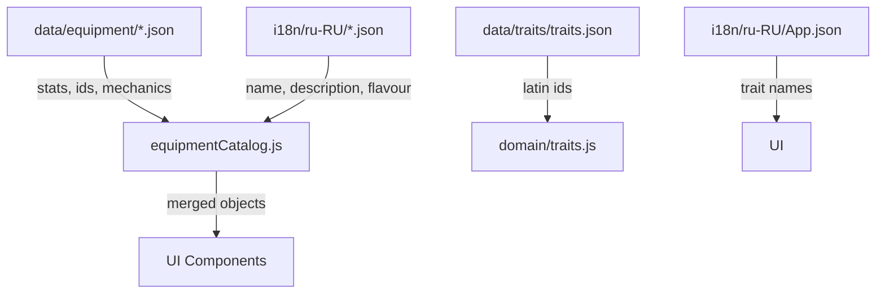

# Дизайн: Очистка данных и i18n

## Обзор

Проект — React Native приложение (Expo) для настольной RPG по вселенной Fallout. Данные об экипировке, чертах, патронах и расходниках хранятся в двух местах: `data/` (locale-независимые механические данные) и `i18n/<locale>/` (переводы). Проблема в том, что граница размыта: часть механических данных лежит в `i18n/`, в JSON-файлах смешаны кириллические ключи (`Название`, `Name`, `Цена`) с camelCase, а нормализаторы поддерживают legacy-поля, создавая дублирование.

Цель — провести однократную миграцию, после которой:
- `data/` содержит только locale-независимые поля (id, stats, mechanics)
- `i18n/<locale>/` содержит только переводимые поля (`name`, `description`, `flavour`, `effectLabel` и т.п.)
- Все ключи в camelCase, никакой кириллицы в ключах и идентификаторах
- Нормализаторы упрощены или удалены

---

## Архитектура

### Текущее состояние

```
i18n/ru-RU/weapons.json        ← содержит ВСЕ поля: stats + name (дублирует data/)
i18n/ru-RU/weapon_mods.json    ← Name, Prefix, Slot, Complexity, Cost... (смешанный стиль)
i18n/ru-RU/qualities.json      ← Name, Effect (PascalCase)
i18n/ru-RU/drinks.json         ← Name, Weight, Cost, Rarity, Positive effect (PascalCase + пробелы)
i18n/ru-RU/robotWeapons.json   ← name + Name + Название (тройное дублирование)
i18n/ru-RU/robotModules.json   ← name + Name + Название
i18n/ru-RU/robotArmor.json     ← name + Name + Название + все stats
i18n/ru-RU/robotItems.json     ← name + Name + все stats
i18n/ru-RU/ammo_types.json     ← id + name + rarity + cost (stats в i18n)
data/equipment/weapons.json    ← stats без name (правильно)
data/equipment/armor.json      ← stats без name (правильно)
data/equipment/mods.json       ← PascalCase ключи: Slot, Complexity, Perk 1, Rarity...
data/traits/traits.json        ← cyrillicName + кириллица в forcedSkills/skillModifiers
```

### Целевое состояние

```
data/equipment/weapons.json    ← stats (без изменений, уже правильно)
data/equipment/armor.json      ← stats (без изменений)
data/equipment/mods.json       ← camelCase: slot, complexity, perk1, perk2, skill, rarity...
data/equipment/ammo.json       ← NEW: id, rarity, cost (перенесено из i18n/ammo_types.json)
data/equipment/robotparts.json ← stats роботов (уже существует, проверить полноту)
data/consumables/chems.json    ← NEW: id, itemType, weight, cost, rarity, effects
data/consumables/drinks.json   ← NEW: id, itemType, weight, cost, rarity, effects
data/traits/traits.json        ← без cyrillicName, forcedSkills/skillModifiers на латинских id

i18n/ru-RU/weapons.json        ← только: id + name + rangeName + flavour + stockNames
i18n/ru-RU/weapon_mods.json    ← только: id + name + prefix + effectDescription
i18n/ru-RU/qualities.json      ← только: id + name + effect (camelCase)
i18n/ru-RU/drinks.json         ← только: id + name + positiveEffectLabel + negativeEffectLabel
i18n/ru-RU/ammo_types.json     ← только: id + name
i18n/ru-RU/robotWeapons.json   ← только: id + name (без Name, Название, stats)
i18n/ru-RU/robotModules.json   ← только: id + name
i18n/ru-RU/robotArmor.json     ← только: id + name (тип группы через i18n-ключ)
i18n/ru-RU/robotItems.json     ← только: id + name
```

### Поток данных после миграции



---

## Компоненты и интерфейсы

### 1. Файлы данных `data/`

#### `data/equipment/mods.json` — переименование ключей
Текущие PascalCase-ключи → camelCase:

| Было | Станет |
|------|--------|
| `Slot` | `slot` |
| `Complexity` | `complexity` |
| `Perk 1` | `perk1` |
| `Perk 2` | `perk2` |
| `Skill` | `skill` |
| `Rarity` | `rarity` |
| `Materials` | `materials` |
| `Cost` | `cost` |
| `Weight` | `weight` |

#### `data/equipment/ammo.json` — новый файл
Перенести из `i18n/ru-RU/ammo_types.json` поля `id`, `rarity`, `cost`. Поле `name` остаётся только в i18n.

```json
[
  { "id": "ammo_001", "rarity": 1, "cost": 2 },
  ...
]
```

#### `data/consumables/chems.json` — новый файл
Перенести из `i18n/ru-RU/chems.json` поля: `id`, `itemType`, `weight`, `cost`, `rarity`, `positiveEffect`, `negativeEffect`, `positiveEffectDuration`, `negativeEffectDuration`, `addictionLevel`.

#### `data/consumables/drinks.json` — новый файл
Перенести из `i18n/ru-RU/drinks.json` поля: `id` (добавить если нет), `itemType`, `weight`, `cost`, `rarity`, `positiveEffect`, `negativeEffect`, `positiveEffectDuration`, `negativeEffectDuration`.

#### `data/traits/traits.json` — очистка
- Удалить поле `cyrillicName` из каждой черты
- Заменить кириллические строки в `forcedSkills` на латинские id навыков
- Заменить кириллические ключи в `skillModifiers` на латинские id

Маппинг навыков (кириллица → latin id):

| Кириллица | Latin id |
|-----------|----------|
| `Энергооружие` | `energy_weapons` |
| `Наука` | `science` |
| `Ремонт` | `repair` |
| `Выживание` | `survival` |
| `Медицина` | `medicine` |
| `Скрытность` | `sneak` |
| `Взлом` | `lockpick` |
| `Красноречие` | `speech` |
| `Бартер` | `barter` |
| `Лёгкое оружие` | `small_guns` |
| `Тяжёлое оружие` | `big_guns` |
| `Рукопашный бой` | `unarmed` |
| `Холодное оружие` | `melee_weapons` |
| `Взрывчатка` | `explosives` |
| `Азартные игры` | `gambling` |

### 2. Файлы переводов `i18n/<locale>/`

#### `i18n/ru-RU/weapons.json` — оставить только переводимые поля
Убрать все stats (damage, fireRate, cost, rarity, ammoId, range, mainAttr, mainSkill, weaponType). Оставить: `id`, `name`, `rangeName`, `flavour`, `stockNames`.

#### `i18n/ru-RU/weapon_mods.json` — переименовать ключи + убрать stats
Убрать: `Slot`, `Complexity`, `Perk 1`, `Perk 2`, `Skill`, `Rarity`, `Materials`, `Cost`, `Weight`, `applies_to_ids`, `effectsLegacy`, `damageModifier`, `fireRateModifier`, `qualityChanges`.
Переименовать: `Name` → `name`, `Prefix` → `prefix`.
Оставить: `id`, `name`, `prefix`, `effectDescription`.

#### `i18n/ru-RU/qualities.json` — переименовать ключи
`Name` → `name`, `Effect` → `effect`, `Opposite` → `opposite`.

#### `i18n/ru-RU/drinks.json` — полная переработка
Добавить `id` (если нет), убрать stats (`Weight`, `Cost`, `Rarity`, `Positive effect`, `Negative effect`, `Positive effect duration`, `Negative effect duration`).
Оставить: `id`, `name`, `positiveEffectLabel`, `negativeEffectLabel`.

#### `i18n/ru-RU/ammo_types.json` — убрать stats
Убрать `rarity`, `cost`. Оставить: `id`, `name`.

#### `i18n/ru-RU/robotWeapons.json` — убрать дубли и stats
Убрать: `Name`, `Название`, все stats (damage, fireRate, cost, rarity, weight, range, weaponType, ammo_id и т.д.).
Оставить: `id`, `name`.

#### `i18n/ru-RU/robotModules.json` — убрать дубли и stats
Убрать: `Name`, `Название`, `weight`, `cost`, `rarity`, `robotOnly`, `grantsItemId`, `grantsEveryHours`.
Оставить: `id`, `name`.

#### `i18n/ru-RU/robotArmor.json` — убрать дубли и stats
Убрать: `Name`, `Название`, все stats.
Оставить: `id`, `name`. Тип группы (`"Броня роботов"`) заменить на i18n-ключ.

#### `i18n/ru-RU/robotItems.json` — убрать дубли и stats
Убрать: `Name`, все stats.
Оставить: `id`, `name`.

Те же изменения применяются к зеркальным файлам в `i18n/en-EN/`.

### 3. `i18n/equipmentNormalizer.js` — упрощение

После миграции:
- Удалить `AREA_LABELS_RU` и `normalizeProtectedArea` — перевод зон переходит в i18n-ключи (`armor.areas.head` и т.п.)
- Удалить `toLegacyArmor` — убрать создание полей `Name`, `Название`, `Физ.СУ`, `Энрг.СУ`, `Рад.СУ`
- Упростить `flattenArmorCatalog` — убрать legacy-ветки с `Name`/`Название`
- Упростить `normalizeClothesCatalog` — убрать создание `Name`/`Название`
- Упростить `normalizeWeaponsCatalog` — убрать fallback на `Name`/`Название`, убрать кириллический алиас `'Стрелковое оружие'` из `WEAPON_TYPE_ALIASES`
- Удалить `buildArmorIndex` по `Name`/`Название` — только по `id`

### 4. `i18n/equipmentCatalog.js` — упрощение `validateConsumablesContract`

Убрать создание полей `Name` и `Название`. Фильтровать только по `name` (camelCase).

### 5. `domain/kitResolver.js` — убрать кириллические поля

Убрать все присвоения `Название`, `Цена`, `Редкость` из возвращаемых объектов. Использовать только `name`, `cost`, `rarity`.

### 6. `domain/modsEquip.js` — убрать кириллические fallback

Убрать `weapon.Название`, `weapon.Урон`, `weapon['Скорость стрельбы']` из геттеров и сеттеров. Использовать только camelCase: `name`, `damage`, `fireRate`.

### 7. `domain/traits.js` — убрать `cyrillicName`

Функция `findTraitByName` ищет только по `id`. Удалить ветку `t.cyrillicName === name`.

### 8. Удаление устаревших файлов

| Файл | Действие |
|------|----------|
| `components/screens/WeaponsAndArmorScreen/kitResolver.js` | Удалить (дублирует `domain/kitResolver.js`) |
| `i18n/ru-RU/light_weapon_mods.json` | Проверить использование; удалить если не используется |
| `i18n/en-EN/light_weapon_mods.json` | Аналогично |
| `docs/cyrillic-db-compat.md` | Обновить/удалить после завершения миграции |

---

## Модели данных

### Схема объекта оружия после миграции

Данные собираются в `equipmentCatalog.js` путём слияния `data/` + `i18n/<locale>/` по `id`:

```js
// Итоговый объект оружия в runtime
{
  id: "weapon_001",          // из data/
  itemType: "weapon",        // из data/
  damage: 6,                 // из data/
  fireRate: 1,               // из data/
  weight: "4",               // из data/
  cost: 99,                  // из data/
  rarity: 2,                 // из data/
  ammoId: "ammo_023",        // из data/
  range: "C",                // из data/
  weaponType: "Light",       // из data/ (нормализованный)
  mainAttr: "AGI",           // из data/
  mainSkill: "SMALL_GUNS",   // из data/
  name: "Револьвер .44",     // из i18n/<locale>/
  rangeName: "Близкая",      // из i18n/<locale>/
  flavour: "...",            // из i18n/<locale>/
}
```

### Схема объекта мода оружия

```js
// data/equipment/mods.json (один элемент weaponMods)
{
  id: "mod_001",
  modType: "weapon",
  slot: "Receivers",
  complexity: 3,
  perk1: "?Gun Nut 1",
  perk2: "",
  skill: "?Repair",
  rarity: "?Uncommon",
  materials: "?Common x 4 Uncommon x 2",
  cost: 30,
  weight: 1,
  applies_to_ids: ["weapon_008"],
  damageModifier: { op: "-", value: 1 },
  fireRateModifier: { op: "+", value: 2 }
}

// i18n/ru-RU/weapon_mods.json (один элемент)
{
  id: "mod_001",
  name: "Rapid",
  prefix: "Rapid",
  effectDescription: "Урон -1 БК, скорострельность +2"
}
```

### Схема черты после миграции

```js
// data/traits/traits.json
{
  "id": "brotherhood-chain-that-binds",
  "originId": "brotherhood",
  "displayNameKey": "traits.brotherhood.chainThatBinds.name",
  "descriptionKey": "traits.brotherhood.chainThatBinds.description",
  "modifiers": {
    "extraSkills": 1,
    "forcedSkills": ["energy_weapons", "science", "repair"]
  }
}
```

### Схема патрона

```js
// data/equipment/ammo.json
{ "id": "ammo_001", "rarity": 1, "cost": 2 }

// i18n/ru-RU/ammo_types.json
{ "id": "ammo_001", "name": "Патрон .357 Магнум" }
```

---

## Совместимость с базой данных (db/seed.js)

`db/seed.js` читает данные из `getEquipmentCatalog()` и записывает их в SQLite. После миграции JSON-файлов seed нужно обновить в нескольких местах:

### `seedWeaponMods` — критично
Сейчас читает PascalCase-поля напрямую:
```js
m.Name, m.Prefix, m.Slot, m.Complexity, m['Perk 1'], m['Perk 2'],
m.Skill, m.Rarity, m.Materials, m.Cost, m.Weight, m.EffectDescription
```
После миграции `data/equipment/mods.json` → camelCase и `i18n/*/weapon_mods.json` → camelCase, seed должен читать:
```js
m.name, m.prefix, m.slot, m.complexity, m.perk1, m.perk2,
m.skill, m.rarity, m.materials, m.cost, m.weight, m.effectDescription
```
Для этого `equipmentCatalog.js` должен мержить данные из `data/` (stats) и `i18n/` (name, prefix, effectDescription) по `id` перед передачей в seed.

### `seedQualities` — критично
Сейчас читает `q.Name`, `q.Effect`, `q.Opposite`. После миграции → `q.name`, `q.effect`, `q.opposite`.

### `seedItems` — критично
Сейчас читает кириллические поля: `item['Физ.СУ']`, `item['Энрг.СУ']`, `item['Рад.СУ']`, `item['Цена']`, `item['Вес']`, `item['Редкость']`, `item['Название']`.
После миграции → `item.physicalDamageRating`, `item.energyDamageRating`, `item.radiationDamageRating`, `item.cost`, `item.weight`, `item.rarity`, `item.name`.

### `seedWeapons` — минорно
Убрать fallback на `w.Name`, `w['Weapon Type']`, `w['Damage Rating']` и т.п. — после миграции все поля будут в camelCase.

### `seedAmmoTypes` — минорно
После разделения ammo на `data/equipment/ammo.json` (stats) + `i18n/*/ammo_types.json` (name), catalog должен мержить их перед передачей в seed. Схема БД `ammo_types` не меняется.

### Схема БД (`db/schema.js`) — не меняется
Таблицы `weapons`, `weapon_mods`, `ammo_types`, `weapon_qualities`, `items` остаются без изменений. Меняется только то, как seed читает данные из JSON.

### Версия схемы
После завершения миграции `SCHEMA_VERSION` в `db/schema.js` нужно увеличить на 1, чтобы принудительно пересеять БД у всех пользователей.

---

## Обработка ошибок

- Если при слиянии `data/` + `i18n/` объект не найден по `id` в i18n — использовать `id` как fallback для `name`, логировать предупреждение в dev-режиме
- Если `forcedSkills` содержит неизвестный latin id — логировать предупреждение, пропускать
- Нормализатор не должен падать при отсутствии поля `name` — возвращать пустую строку

---

## Стратегия тестирования

### Unit-тесты (domain/)

- `domain/traits.js`: `findTraitByName` находит только по `id`, не по `cyrillicName`
- `domain/modsEquip.js`: `applyModification` читает `damage`/`fireRate` (не кириллицу)
- `domain/kitResolver.js`: возвращаемые объекты содержат `name`, не `Название`

### Snapshot / contract-тесты (i18n/)

- Каждый файл в `i18n/ru-RU/` не содержит ключей `Name`, `Название`
- Каждый файл в `data/` не содержит кириллических ключей
- `data/equipment/mods.json` не содержит ключей `Slot`, `Complexity`, `Perk 1`

### Интеграционные тесты

- `getEquipmentCatalog()` возвращает оружие с полем `name` (строка, не пустая)
- `getEquipmentCatalog()` возвращает моды с полем `name` и `prefix`
- `resolveKitItems()` возвращает предметы с `name`, без `Название`

---

## Порядок выполнения (зависимости)

Миграция выполняется в следующем порядке, чтобы не сломать работающий код:

1. Мигрировать `data/equipment/mods.json` (переименовать ключи) + обновить `domain/modsEquip.js`
2. Создать `data/equipment/ammo.json` + очистить `i18n/*/ammo_types.json`
3. Создать `data/consumables/chems.json` и `drinks.json` + очистить `i18n/*/chems.json`, `drinks.json`
4. Очистить `i18n/*/weapon_mods.json`, `qualities.json` (переименовать ключи)
5. Очистить `i18n/*/robotWeapons.json`, `robotModules.json`, `robotArmor.json`, `robotItems.json`
6. Очистить `i18n/*/weapons.json` (убрать stats, оставить только переводы)
7. Мигрировать `data/traits/traits.json` (убрать cyrillicName, латинские id навыков)
8. Обновить `domain/traits.js` (убрать cyrillicName lookup)
9. Упростить `i18n/equipmentNormalizer.js`
10. Упростить `i18n/equipmentCatalog.js` (validateConsumablesContract)
11. Обновить `domain/kitResolver.js` (убрать Название/Цена/Редкость)
12. Удалить устаревшие файлы
