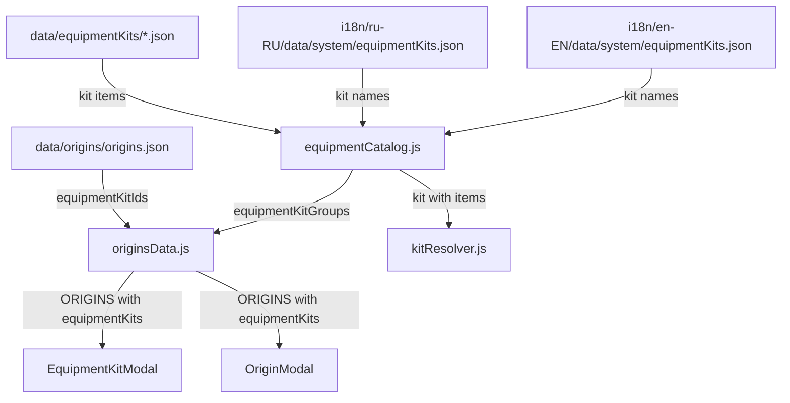

# Design Document: equipment-kits-split

## Overview

Рефакторинг структуры данных комплектов снаряжения (equipment kits). Монолитный файл `i18n/ru-RU/data/system/equipmentKits.json` (1835 строк) смешивает два типа данных:

1. **Локаль-независимые игровые данные** — состав комплектов (`items`), который одинаков для всех языков.
2. **Локаль-зависимые строки** — названия комплектов (`name`), которые нужно переводить.

Кроме того, файл дублирует маппинг origin → kit IDs, который уже является частью `data/origins/origins.json`.

Цель рефакторинга — разделить эти данные по ответственности:
- `data/equipmentKits/*.json` — игровые данные (состав комплектов), без локализации
- `i18n/{locale}/data/system/equipmentKits.json` — только названия комплектов
- `i18n/equipmentCatalog.js` — объединяет оба источника в единый `equipmentKitGroups`

Изменения затрагивают только слой загрузки данных. `domain/kitResolver.js` не меняется — он продолжает получать kit с полем `items` в том же формате.

## Architecture



### Поток данных (до рефакторинга)

```
i18n/ru-RU/data/system/equipmentKits.json
  └── equipmentKitGroups: { [kitId]: { name, items } }
        ↓ прямой импорт
  originsData.js → ORIGINS[].equipmentKits
```

### Поток данных (после рефакторинга)

```
data/equipmentKits/*.json          i18n/{locale}/data/system/equipmentKits.json
  └── { [kitId]: { items } }         └── { [kitId]: { name } }
        ↓                                   ↓
        equipmentCatalog.js → merge → equipmentKitGroups: { [kitId]: { name, items } }
                                              ↓ getEquipmentCatalog()
                                        originsData.js → ORIGINS[].equipmentKits
```

## Components and Interfaces

### Новые файлы данных: `data/equipmentKits/`

Каждый файл содержит объект вида `{ [kitId]: { items: [...] } }` — без поля `name`.

| Файл | Kit IDs |
|------|---------|
| `list.json` | Маппинг `[{ originId, kitIds }]` для всех origins |
| `brotherhood.json` | `brotherhood_initiate`, `brotherhood_scribe` |
| `ncr.json` | `ncr_infantry`, `ncr_caravaneer`, `ncr_marksman` |
| `minuteman.json` | `minuteman_shooter`, `minuteman_skirmisher` |
| `childOfAtom.json` | `atom_missionary`, `atom_zealot` |
| `vaultDweller.json` | `vault_security`, `vault_resident` |
| `wastelander.json` | `wastelander_mercenary`, `wastelander_settler`, `wastelander_wanderer`, `wastelander_raider`, `wastelander_trader` |
| `superMutant.json` | `supermutant_bruiser`, `supermutant_skirmisher` |
| `brotherhoodOutcast.json` | `outcast_former_knight`, `outcast_former_scribe` |
| `robobrain.json` | `robobrain_hypnotron` |
| `misterHandy.json` | `mister_handy_assistant`, `mister_handy_brave`, `mister_handy_nanny`, `mister_handy_medic`, `mister_handy_farmer` |
| `default.json` | `default_caps_only` |

Примечание: `wastelander.json` используется для `ghoul` и `survivor` — оба origin ссылаются на одни и те же kit IDs, данные хранятся в одном файле без дублирования.

### Обновлённые i18n файлы

`i18n/ru-RU/data/system/equipmentKits.json` и `i18n/en-EN/data/system/equipmentKits.json` принимают новый формат:

```json
{
  "brotherhood_initiate": { "name": "Комплект Посвящённого" },
  "brotherhood_scribe": { "name": "Комплект Писца" },
  ...
}
```

Секция `origins` и секция `equipmentKitGroups` удаляются. Остаются только названия.

### `i18n/equipmentCatalog.js` — обновление

Добавляются импорты всех `data/equipmentKits/*.json` файлов. Новая функция `buildEquipmentKitGroups()` объединяет kit data с i18n названиями:

```js
// Импорты kit data (локаль-независимые)
import dataKitsBrotherhood from '../data/equipmentKits/brotherhood.json';
import dataKitsNcr from '../data/equipmentKits/ncr.json';
// ... остальные файлы

// Объединение всех kit data в один объект
const ALL_KIT_DATA = {
  ...dataKitsBrotherhood,
  ...dataKitsNcr,
  // ...
};

// В getEquipmentCatalog():
const kitNames = i18n.equipmentKits || {};
const equipmentKits = Object.fromEntries(
  Object.entries(ALL_KIT_DATA).map(([kitId, kitData]) => [
    kitId,
    {
      name: kitNames[kitId]?.name || kitId,
      ...kitData,
    },
  ])
);
```

Возвращаемый объект `equipmentKits` сохраняет форму `{ [kitId]: { name, items } }` — обратная совместимость с текущим кодом.

### `components/screens/CharacterScreen/logic/originsData.js` — обновление

Убирается прямой импорт из `i18n/ru-RU/data/system/equipmentKits.json`. Данные комплектов берутся через `getEquipmentCatalog()`:

```js
// Было:
import equipmentKitsData from '../../../../i18n/ru-RU/data/system/equipmentKits.json';
const equipmentKitGroups = equipmentKitsData.equipmentKitGroups || {};

// Станет:
import { getEquipmentCatalog } from '../../../../i18n/equipmentCatalog';
const { equipmentKits: equipmentKitGroups } = getEquipmentCatalog();
```

Логика построения `ORIGINS` не меняется — `equipmentKitGroups` сохраняет ту же форму.

### `domain/kitResolver.js` — без изменений

`kitResolver.js` получает объект kit с полем `items` через `resolveKitItems(kit)`. Источник kit не меняется с точки зрения kitResolver — он по-прежнему получает `{ id, name, items }`. Файл не требует изменений.

## Data Models

### KitData (локаль-независимый, `data/equipmentKits/*.json`)

```typescript
type KitItem = {
  type: 'fixed' | 'choice' | 'rollTable';
  weaponId?: string;
  armorId?: string;
  clothingId?: string;
  itemId?: string;
  itemType?: string;
  ammo?: { ammoId?: string; quantity: { base: number; rollType?: string; rollValue?: number; op?: string } };
  modIds?: string[];
  quantity?: number | { base: number; rollType?: string; rollValue?: number; op?: string };
  tableId?: string;
  roll?: { rollType: string; count: number; mode: string };
  items?: KitItem[];  // для type: 'choice'
  group?: KitItem[];  // для вложенных групп в choice
};

type KitData = {
  [kitId: string]: {
    items: KitItem[];
    // поле name ОТСУТСТВУЕТ
  };
};
```

### KitNames (локаль-зависимый, `i18n/{locale}/data/system/equipmentKits.json`)

```typescript
type KitNames = {
  [kitId: string]: {
    name: string;
  };
};
```

### KitGroup (объединённый, результат `getEquipmentCatalog().equipmentKits`)

```typescript
type KitGroup = {
  [kitId: string]: {
    name: string;   // из i18n, fallback = kitId
    items: KitItem[];  // из data/equipmentKits/
  };
};
```

### list.json

```typescript
type KitList = Array<{
  originId: string;
  kitIds: string[];
}>;
```

## Correctness Properties

*A property is a characteristic or behavior that should hold true across all valid executions of a system — essentially, a formal statement about what the system should do. Properties serve as the bridge between human-readable specifications and machine-verifiable correctness guarantees.*

### Property 1: Полнота kit IDs в data файлах

*For any* kit ID, перечисленного в `equipmentKitIds` любого origin в `data/origins/origins.json`, этот kit ID должен присутствовать ровно в одном файле из `data/equipmentKits/*.json` (исключая `list.json`).

**Validates: Requirements 6.1, 6.3**

### Property 2: Целостность items при разделении

*For any* kit ID, поле `items` в новых `data/equipmentKits/*.json` файлах должно быть структурно идентично полю `items` в старом `equipmentKitGroups` из `i18n/ru-RU/data/system/equipmentKits.json`.

**Validates: Requirements 1.7, 6.2**

### Property 3: Формат KitData файлов

*For any* kit ID в любом файле `data/equipmentKits/*.json` (кроме `list.json`), объект для этого kit ID должен содержать поле `items` (массив) и не должен содержать поле `name`.

**Validates: Requirements 1.6**

### Property 4: Полнота KitNames в i18n

*For any* уникального kit ID из `equipmentKitIds` всех origins в `data/origins/origins.json`, этот kit ID должен присутствовать в `i18n/ru-RU/data/system/equipmentKits.json` и `i18n/en-EN/data/system/equipmentKits.json`.

**Validates: Requirements 2.3**

### Property 5: Форма equipmentKits в getEquipmentCatalog()

*For any* kit ID в `data/equipmentKits/*.json`, результат `getEquipmentCatalog().equipmentKits[kitId]` должен содержать поле `name` типа string и поле `items` типа array.

**Validates: Requirements 3.2, 3.3**

### Property 6: Корректность ORIGINS после рефакторинга

*For any* origin в массиве `ORIGINS` из `originsData.js`, каждый элемент `equipmentKits` должен иметь `Array.isArray(items) === true`, и набор kit IDs должен совпадать с `equipmentKitIds` соответствующего origin из `data/origins/origins.json`.

**Validates: Requirements 4.3, 4.4**

## Error Handling

### Отсутствующий kit ID в i18n

Если kit ID присутствует в `data/equipmentKits/*.json`, но отсутствует в i18n файле текущей локали, `getEquipmentCatalog()` использует kit ID как `name`. Это поведение уже реализовано в паттерне `mergeById` и должно быть воспроизведено для kit groups.

```js
name: kitNames[kitId]?.name || kitId
```

### Отсутствующий kit ID в data файлах

Если `originsData.js` запрашивает kit ID, которого нет в `ALL_KIT_DATA`, фильтр `Array.isArray(kit.items)` исключит его из `equipmentKits` origin. Поведение идентично текущему (kit без `items` отфильтровывается).

### Некорректная структура items

`kitResolver.js` не меняется и обрабатывает некорректные items так же, как сейчас — через `safeDbCall` и fallback значения.

## Testing Strategy

Данный рефакторинг — это преобразование структуры данных без изменения поведения. PBT применим для проверки инвариантов целостности данных.

**Библиотека**: [fast-check](https://github.com/dubzzz/fast-check) (уже используется в экосистеме JS/React Native).

**Конфигурация**: минимум 100 итераций на каждый property test.

### Unit тесты

- Проверка формата каждого нового `data/equipmentKits/*.json` файла (наличие `items`, отсутствие `name`)
- Проверка формата новых i18n файлов (наличие `name`, отсутствие `origins` и `equipmentKitGroups`)
- Проверка fallback поведения: kit ID без i18n записи → name = kit ID
- Проверка что `originsData.js` не импортирует напрямую из i18n

### Property тесты

Каждый property test реализует один из Correctness Properties выше.

**Tag format**: `Feature: equipment-kits-split, Property {N}: {property_text}`

- **Property 1** — генерировать случайный originId из origins.json, проверять что его kitIds покрыты ровно одним data файлом
- **Property 2** — для каждого kitId сравнивать items из нового источника со старым
- **Property 3** — для каждого kitId в data файлах проверять структуру объекта
- **Property 4** — для каждого kitId из origins.json проверять наличие в обоих i18n файлах
- **Property 5** — вызывать `getEquipmentCatalog()` и проверять форму каждого kit в результате
- **Property 6** — для каждого origin в ORIGINS проверять корректность equipmentKits

### Интеграционные тесты

- Вызов `resolveKitItems(kit)` с kit из нового источника — результат должен совпадать с результатом из старого источника для одинакового kit ID
- Проверка что `ORIGINS` строится корректно и все origins имеют ожидаемые equipmentKits
