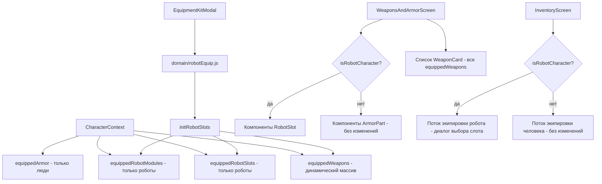

# Дизайн-документ: Переработка экипировки роботов

## Обзор

Данный дизайн реализует систему слотов для роботов, динамические массивы оружия, трёхслойную защиту брони и автозаполнение из комплектов снаряжения. Изменения аддитивны для роботов и минимально затрагивают людей. Основной принцип: роботы используют `equippedRobotSlots` + `equippedRobotModules` как источник истины; люди продолжают использовать `equippedArmor` без изменений.

## Архитектура



## Компоненты и интерфейсы

### 1. `domain/robotEquip.js` (новый файл)

Чистые функции, без React, без зависимостей от UI.

```js
// Определяет, является ли персонаж роботом
isRobotCharacter(character: { origin,}) → boolean

// Возвращает схему слотов для заданного шасси
getRobotSlotKeys(bodyPlan: string) → string[]
// protectron → ['head','body','leftArm','rightArm','leftLeg','rightLeg']
// misterHandy → ['head','body','arm1','arm2','arm3','thruster']
// robobrain   → ['head','body','leftArm','rightArm','chassis']

// Создаёт пустую структуру слотов для шасси
createEmptyRobotSlots(bodyPlan: string) → RobotSlotsObject

// Обрабатывает разрешённые предметы комплекта в слоты, оружие, модули, инвентарь
initRobotSlots(bodyPlan, resolvedKitItems, robotCatalog) → {
  slots: RobotSlotsObject,
  weapons: WeaponObject[],
  modules: ModuleObject[],
  inventoryItems: InventoryItem[]
}

// Формирует массив equippedWeapons из текущего состояния слотов
getBuiltinWeaponsFromSlots(slots: RobotSlotsObject) → WeaponObject[]

// Проверяет, можно ли установить конечность в слот
canReplaceLimb(slotKey, newLimb, character) → { allowed: boolean, reason: string|null }

// Применяет замену конечности, возвращает обновлённые слоты и пересобранный массив оружия
applyLimbReplacement(slots, slotKey, newLimb) → { slots: RobotSlotsObject, weapons: WeaponObject[] }

// Проверяет, может ли оружие удерживаться конечностью слота
canEquipWeaponToSlot(weapon, slotData, character) → { allowed: boolean, reason: string|null }

// Проверяет, можно ли установить броню в слой слота
canEquipRobotArmor(armorItem, slotKey, layer, slots) → { allowed: boolean, reason: string|null }
```

### 2. Структуры данных

#### RobotSlotData
```ts
{
  limb: LimbObject | null,
  armor: ArmorObject | null,      // слой: "armor"
  plating: PlatingObject | null,  // слой: "plating"
  frame: FrameObject | null,      // слой: "frame"
  heldWeapon: WeaponObject | null // только для слотов рук
}
```

#### RobotSlotsObject
```ts
// Протектрон / Ассолтрон / Сентри Бот
{ head, body, leftArm, rightArm, leftLeg, rightLeg }

// Мистер Хэнди
{ head, body, arm1, arm2, arm3, thruster }

// Робомозг
{ head, body, leftArm, rightArm, chassis }
```

#### WeaponObject (расширенный)
```ts
{
  ...существующие поля оружия,
  sourceSlot?: string,       // например "leftArm", "arm1" — для метки в UI
  isBuiltin?: boolean,       // нельзя снять
  isManipulator?: boolean,   // оружие-манипулятор
}
```

### 3. Правила совместимости слоёв брони

На основе поля `incompatibleLayers` из `armor_plating.json`:

| Слой | Совместим с |
|------|-------------|
| `plating` | ни с чем (несовместим с `armor` и `frame`) |
| `armor` | `frame` |
| `frame` | `armor` |

`canEquipRobotArmor` проверяет существующие слои слота против массива `incompatibleLayers` нового предмета.

### 4. Алгоритм `initRobotSlots`

Обрабатывает разрешённые предметы комплекта (уже разрешённые через `kitResolver.js`) по порядку:

1. Создать пустые слоты через `createEmptyRobotSlots(bodyPlan)`
2. Автоматически добавить конечности по умолчанию для слотов, не покрытых предметами комплекта (из `robotCatalog`)
3. Для каждого разрешённого предмета комплекта:
   - `itemType` в `['robotArm','robotHead','robotBody','robotLeg']` → поместить в `slots[slotKey].limb`
     - Выбор слота: использовать `item.slot` если указан, иначе первый подходящий свободный слот
   - `itemType === 'weapon'` с `replacesArm: true` → поместить в `slots[slotKey].limb` (оружие выступает конечностью)
   - `itemType === 'weapon'` с `requiresWeaponId` → найти слот, где `limb.id === requiresWeaponId`, установить `heldWeapon`
   - `itemType === 'weapon'` с `slot: "left"|"right"` → маппинг на `leftArm`/`rightArm` (или `arm1`/`arm2` для Хэнди), установить `heldWeapon`
   - `itemType === 'weapon'` (без slot/requiresWeaponId) → поместить в первый доступный слот руки как `heldWeapon`
   - `itemType` в `['plating','armor','frame']` → поместить в `slots[slotKey][layer]` для всех слотов, соответствующих `robotLocation`
   - `itemType === 'module'` → добавить в `modules[]`
   - Всё остальное → добавить в `inventoryItems[]`
4. Собрать `weapons[]` через `getBuiltinWeaponsFromSlots(slots)`:
   - Для каждого слота с `limb.builtinWeaponId` → добавить оружие с `sourceSlot`, `isBuiltin: true`
   - Для каждого слота руки с `limb.builtinManipulator: true` и без `heldWeapon` → добавить манипулятор как оружие
   - Для каждого слота руки с `heldWeapon` → добавить удерживаемое оружие с `sourceSlot`
   - Для слотов головы с оружием `builtinToHead` → добавить оружие с `sourceSlot`, `isBuiltin: true`

### 5. Изменения `EquipmentKitModal`

При вызове `onSelectKit` для персонажа-робота:
- Определить робота через `isRobotCharacter(character)`
- Вызвать `initRobotSlots(bodyPlan, resolvedItems, robotCatalog)`
- Передать `{ slots, weapons, modules, inventoryItems, caps }` обратно в `CharacterScreen`
- `CharacterScreen` вызывает `setEquippedRobotSlots`, `setEquippedRobotModules`, `setEquippedWeapons`, `setEquipment`

Для людей: существующий поток без изменений, но также устанавливается `equippedWeapons` с `unarmed_human`.

### 6. Изменения `CharacterContext`

Новые поля состояния:
```js
const [equippedRobotSlots, setEquippedRobotSlots] = useState(null);
const [equippedRobotModules, setEquippedRobotModules] = useState([]);
```

Начальное значение `equippedWeapons` меняется:
```js
// Было: [null, null]
// Стало: []  (заполняется при выборе комплекта или загрузке персонажа)
```

`buildSnapshot` и `serializeState`/`deserializeState` обновляются для включения новых полей.

`resetCharacter` очищает `equippedRobotSlots` до `null` и `equippedRobotModules` до `[]`.

### 7. Изменения `WeaponsAndArmorScreen`

#### Ветка робота (новая)
```
RobotEquipmentSection
  └── для каждого slotKey в getRobotSlotKeys(bodyPlan):
        RobotSlot
          ├── название слота + название конечности
          ├── индикаторы слоёв брони (обшивка / броня / рама + значения DR)
          ├── информация об оружии (если слот является источником оружия)
          ├── Кнопка: "Модернизировать конечность" → LimbUpgradeModal
          ├── Кнопка: "Улучшить броню" → ArmorLayerModal(layer='armor')
          ├── Кнопка: "Улучшить обшивку" → ArmorLayerModal(layer='plating')
          └── Кнопка: "Улучшить раму" → ArmorLayerModal(layer='frame')
```

#### Секция оружия (и люди, и роботы)
Динамический список — рендерит один `WeaponCard` на каждый элемент `equippedWeapons`. Для роботов каждая карточка показывает метку `sourceSlot`.

#### Ветка человека
Без изменений — компоненты `ArmorPart` как прежде.

### 8. Новые модальные окна

#### `LimbUpgradeModal`
- Пропсы: `slotKey`, `currentLimb`, `bodyPlan`, `onSelect`, `onClose`
- Источник данных: `data/equipment/robot/robotarms.json`, `robotheads.json`, `robotbody.json`, `robotlegs.json`
- Фильтрация по `itemType` соответствующему типу слота и `compatibleBodyPlans` или `defaultForBodyPlan`
- При выборе: вызывает `applyLimbReplacement`, обновляет контекст

#### `ArmorLayerModal`
- Пропсы: `slotKey`, `layer` (`'plating'|'armor'|'frame'`), `currentItem`, `robotLocation`, `onSelect`, `onClose`
- Источник данных: `data/equipment/robot/armor_plating.json`, `armor.json`, `frames.json`
- Фильтрация по `layer` и `robotLocation` соответствующему слоту
- Проверка совместимости через `canEquipRobotArmor`

### 9. Изменения `InventoryScreen`

Поток экипировки оружия для робота:
- "Экипировать" на оружии → проверить `isRobotCharacter`
- Если робот: проверить наличие хотя бы одного слота руки с `limb.canHoldWeapons: true`
  - Если такой руки нет → кнопка "Экипировать" не отображается, вместо неё — предупреждение (существующий алерт `manipulatorRequiredTitle`)
  - Если рука есть → добавить оружие в `equippedWeapons` напрямую (без диалога выбора слота), пометить `sourceSlot` первой доступной руки
- Робот может носить любое количество стандартного оружия, пока есть хотя бы одна рука с `canHoldWeapons`

Поток снятия оружия для робота:
- "Снять" на оружии с `isBuiltin: true` или `isManipulator: true` → кнопка неактивна/скрыта
- "Снять" на удерживаемом оружии → убрать из `equippedWeapons`, вернуть оружие в инвентарь

Предметы-конечности скрыты в инвентаре (фильтруются из отображения) — будущий документ рассмотрит их отображение.

### 10. Изменения `AddItemModal`

После выбора предмета показывается шаг выбора количества перед закрытием:
- Новое внутреннее состояние: `pendingItem`, `pendingQuantity`
- При нажатии на предмет: установить `pendingItem`, показать элементы управления количеством
- Элементы управления: кнопка `-`, числовой `TextInput`, кнопка `+` (тот же стиль, что в `SellItemModal`)
- Кнопка "Добавить" вызывает `onSelectItem(item, quantity)` и закрывает модалку
- Количество по умолчанию: 1

`InventoryScreen.handleSelectCatalogItem` обновляется для приёма `(item, quantity)`.

### 11. Оружие `unarmed_human`

Добавляется в `data/equipment/weapons.json`:
```json
{
  "id": "unarmed_human",
  "itemType": "weapon",
  "weaponType": "Unarmed",
  "damage": 2,
  "damageType": "physical",
  "range": "C",
  "mainAttr": "STR",
  "mainSkill": "UNARMED",
  "weight": 0,
  "cost": 0,
  "rarity": 0,
  "isBuiltin": true,
  "qualities": [{ "qualityId": "quality_close_quarters" }]
}
```

Ключи i18n добавляются для названия "Кулаки" (ru) / "Fists" (en).

### 12. Обновление JSON комплектов снаряжения

JSON-файлы комплектов роботов (`protectron.json`, `misterHandy.json`, `robobrain.json`) обновляются для включения явных предметов-конечностей. Конечности по умолчанию (голова, корпус, ноги) добавляются автоматически если не указаны в комплекте. Руки — всегда из комплекта, так как они варьируются от варианта к варианту.

Возможные варианты для слота руки в комплекте:
- Обычная рука-манипулятор: `{ "itemType": "robotArm", "itemId": "robot_arm_protectron", "slot": "left" }`
- Оружие в слот руки (удерживаемое): `{ "itemType": "weapon", "weaponId": "...", "slot": "left" }`
- Оружие-конечность (заменяет руку): `{ "itemType": "weapon", "weaponId": "robot_weapon_circular_saw", "replacesArm": true }`
- Слот руки может отсутствовать в комплекте — тогда рука не добавляется

Пример добавления конечностей по умолчанию для `protectron_standard` (голова, корпус, ноги — автоматически; руки — из комплекта):
```json
{ "type": "fixed", "itemType": "robotArm", "itemId": "robot_arm_protectron", "slot": "left" },
{ "type": "fixed", "itemType": "robotArm", "itemId": "robot_arm_protectron", "slot": "right" }
```

Мистер Хэнди: руки заполняют `arm1`, `arm2`, `arm3` по порядку из предметов комплекта.

## Модели данных

### Сериализация `equippedRobotSlots`
Хранится как обычный объект (без Map). Каждое значение слота — обычный объект с nullable-полями. Сериализуется напрямую через `JSON.stringify` в `serializeState`.

### Миграция `equippedWeapons`
При `loadCharacter`: если загруженное значение `[null, null]` или содержит null → отфильтровать null → результат `[]` или существующее оружие. Персонажи-люди получают `unarmed_human` если его нет.

## Обработка ошибок

- `initRobotSlots`: если предмет комплекта ссылается на неизвестный `itemId` → пропустить предмет, записать предупреждение, продолжить
- `canEquipRobotArmor`: возвращает `{ allowed: false, reason: i18nKey }` при конфликте слоёв
- `canReplaceLimb`: возвращает `{ allowed: false, reason: i18nKey }` при несовместимом шасси
- `canEquipWeaponToSlot`: возвращает `{ allowed: false, reason: i18nKey }` при нарушении веса/двуручности
- Все доменные функции чистые и никогда не бросают исключения — ошибки возвращаются как объекты результата

## Стратегия тестирования

- Юнит-тесты для `domain/robotEquip.js`:
  - `isRobotCharacter` — все три пути определения
  - `initRobotSlots` — для `protectron_standard`, `mister_handy_assistant`, `robobrain_hypnotron`
  - `getBuiltinWeaponsFromSlots` — проверка состава массива оружия
  - `canEquipRobotArmor` — матрица совместимости слоёв
  - `applyLimbReplacement` — обновление слота + пересборка оружия
- Интеграция: `EquipmentKitModal` → `initRobotSlots` → состояние контекста для каждого варианта комплекта робота
- Регрессия: создание персонажа-человека по-прежнему добавляет `unarmed_human` в `equippedWeapons`

## Примечания

- `equippedArmor` не затрагивается — роботы просто никогда не читают и не записывают его
- `isRobotCharacter` определяется только по `origin.isRobot` — этого достаточно, проверка `trait.modifiers` избыточна
- Проверка `isRobotCharacter` в `domain/equipEquip.js` заменяется новой унифицированной функцией из `domain/robotEquip.js`; `equipEquip.js` будет импортировать из `robotEquip.js`
- Будущий документ: управление конечностями в инвентаре (отображение снятых конечностей, экипировка из инвентаря, кнопка "снять конечность")
